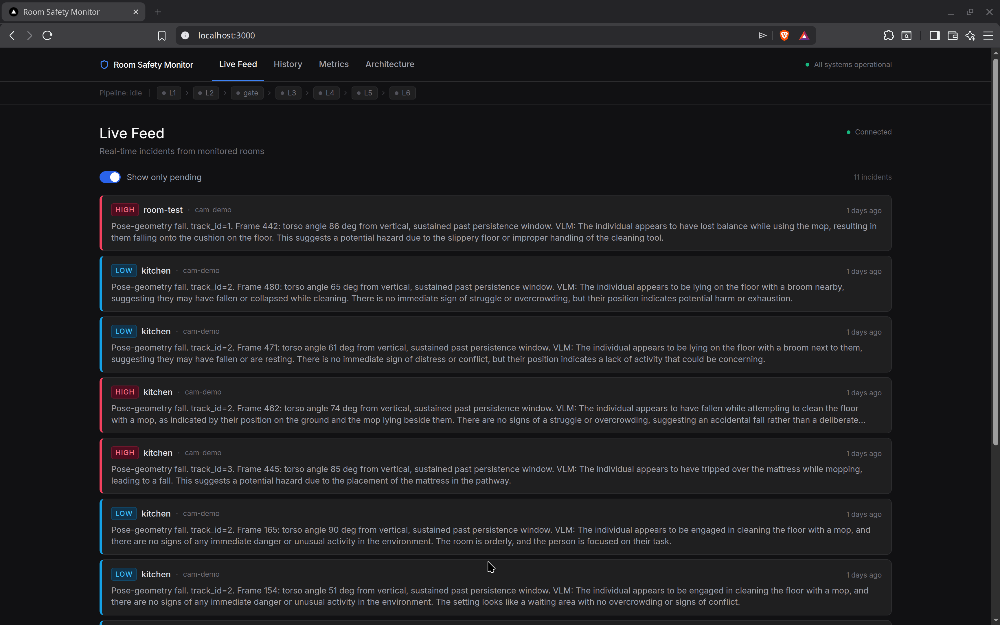
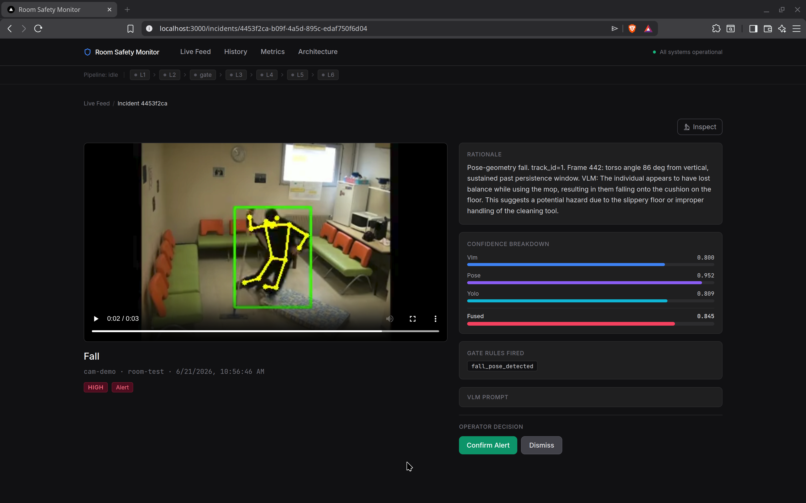
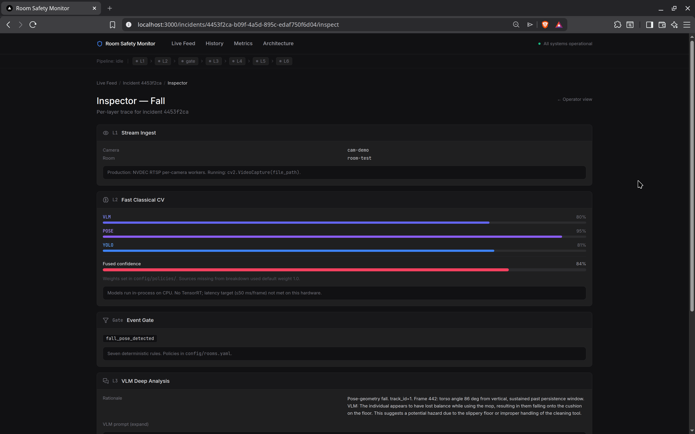
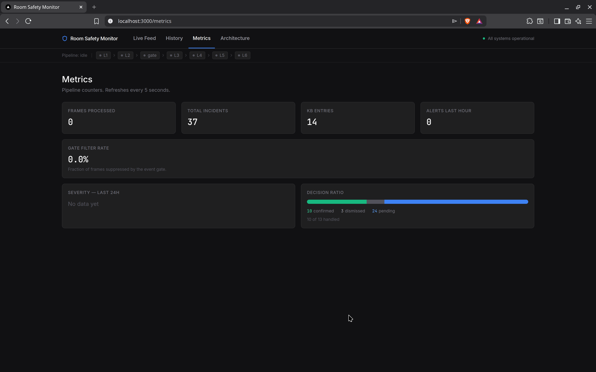
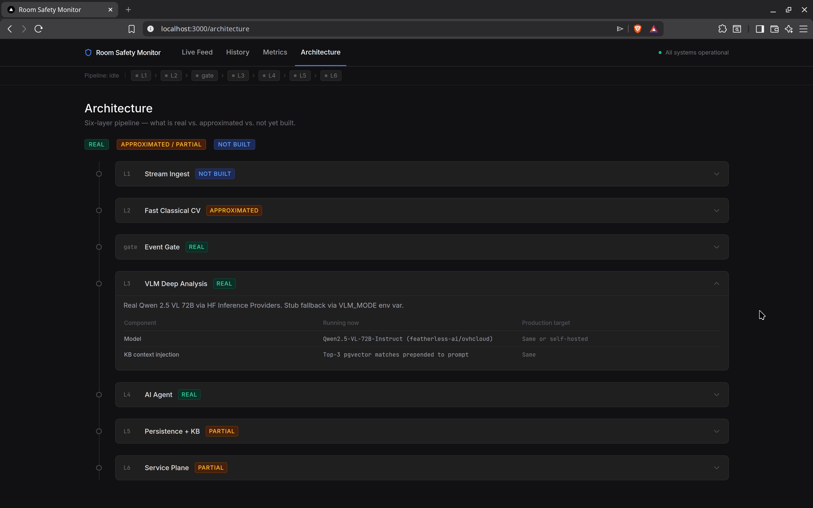

# Room safety monitoring

A six-layer real-time pipeline for room safety monitoring at scale. A fast perception layer (YOLOv8 + RTMPose + SlowFast) runs on every frame and an event gate passes roughly 1% of frames to a VLM (Qwen 2.5 VL) for deep analysis. A LangGraph agent fuses confidence from all sources, applies facility policy rules, and makes the alert or dismiss decision. Operators review alerts on a Next.js dashboard, submit feedback, and that feedback writes back to a pgvector knowledge base that improves future VLM prompts.

---

## Architecture

Six layers in a cascade. Each layer runs only on the output of the previous one.

```
  Video / RTSP  -->  L1 Ingest  -->  L2 Fast CV  -->  [Event Gate ~1%]
                                                              |
                                                    L3 VLM Analysis
                                                    (Qwen 2.5 VL 72B)
                                                              |
                                                    L4 AI Agent (LangGraph)
                                                              |
                                                    L5 Persistence + KB
                                                    (Postgres + pgvector + MinIO)
                                                              |
                                                    L6 Service Plane
                                                    (FastAPI + Next.js)
```

Full layer descriptions, data flow, and production vs demo differences: [docs/ARCHITECTURE.md](docs/ARCHITECTURE.md).

---

## Datasets

A single example fall video is bundled in `demo/example_fall.mp4` so the quickstart works without downloading anything. The eval numbers reported in `docs/EVAL_RESULTS.md` were computed on two full academic datasets:

**Le2i Fall Detection Dataset** (full eval reproduction):
- Download from: https://www.kaggle.com/datasets/tuyenldvn/falldataset-imvia
- Extract to `data/le2i/` so the structure is `data/le2i/Coffee_room_01/Coffee_room_01/Videos/...`
- Citation: I. Charfi et al., "Optimised spatio-temporal descriptors for real-time fall detection", JEI, 2013

**UR Fall Detection Dataset** (full eval reproduction):
- Download from: https://www.kaggle.com/datasets/shahliza27/ur-fall-detection-dataset
- Extract to `data/ur_fall/`

The system accepts any video file via the `video_path` field in the curl request — you can point it at your own footage too.

---

## Quickstart

**Requirements:** Python 3.11 or 3.12, Node 18+, Docker.

```bash
git clone https://github.com/vasu-tyagi/room-safety-monitor.git
cd room-safety-monitor

# Configure environment
cp .env.example .env
# Edit .env: add HF_TOKEN if you want real VLM responses.
# Without a token, VLM_MODE=auto falls back to a stub —
# the full pipeline still runs end-to-end.

# Start Postgres
cd deploy && docker compose up -d postgres && cd ..

# Python environment
python -m venv venv
source venv/bin/activate
pip install -r requirements.txt
alembic upgrade head

# Start the service plane
uvicorn services.service_plane.app:app --reload &

# Start the dashboard
cd services/dashboard && npm install && npm run dev
# Open http://localhost:3000
```

For the full demo with real VLM responses, set `HF_TOKEN` and `VLM_MODE=real` in `.env`. Without an HF token, `VLM_MODE=auto` uses a deterministic stub fallback; the incident still goes through the full agent pipeline and writes to Postgres.

Automated startup: `bash scripts/demo.sh` starts Postgres, runs migrations, and launches both processes.

### Example request

```bash
curl -X POST http://localhost:8000/process_video \
  -H "Content-Type: application/json" \
  -d '{"video_path": "data/le2i/Coffee_room_02/Coffee_room_02/Videos/video (49).avi",
       "camera_id": "cam-kitchen", "room_id": "kitchen-1"}'
```

Expected response:

```json
{
  "incidents_created": 1,
  "frames_processed": 549,
  "frames_escalated": 3,
  "escalation_ratio": 0.0055,
  "last_incident_state": "alert",
  "last_fused_confidence": 0.72,
  "last_rationale": "Person appears to have fallen..."
}
```

The new incident is immediately broadcast over WebSocket to the dashboard and visible at `GET /incidents`. The pipeline animation on the live feed page lights up each layer dot as the video is processed.

```bash
# Run the canonical example (requires services running):
bash scripts/run_example.sh
```

---

## Screenshots







---

## What is real, what is substituted, and why

| Component | Status | Why |
|-----------|--------|-----|
| L2 detection (YOLOv8n) | **Real** | Existing v0.5 detector, wrapped with class grouping. |
| L2 pose (RTMPose, 17 COCO keypoints) | **Real** | Runs via rtmlib/ONNX. mmcv has no wheel for torch 2.12+cu130; rtmlib uses the same model weights over ONNX Runtime. |
| Pose-geometry fall detection | **Real** | Torso-angle rule (>= 50 deg from vertical) over keypoints. Replaces the v0.5 aspect-ratio rule. Calibrated on Le2i Coffee_room. |
| L2 action (SlowFast, Kinetics-400) | **Real (approx.)** | Real `slowfast_r50`. Preprocessing hand-rolled because `pytorchvideo.transforms` is broken on torchvision 0.27. K400 has no clean "falling" class; we map a curated label set to {falling, fighting, running}. |
| ByteTrack tracker | **Real** | `supervision.ByteTrack`, pinned < 0.30 (removed in 0.30). Per-track fall persistence and pose history (maxlen=32). |
| Event Gate | **Real** | 7 deterministic rules over L2 outputs. N=3 persistence on fall_pose_detected. Room policies in `config/rooms.yaml`. |
| L3 VLM (Qwen 2.5 VL 72B via HF) | **Real** (stub fallback) | Real model via HF Inference Providers. Mode: `real` / `auto` / `stub`. Stub activates on rate-limit or missing token. Every call logs real vs stub. |
| KB retrieval (pgvector, sentence-transformers) | **Real** | `all-mpnet-base-v2` (768-dim), HNSW index in Postgres, cosine >= 0.7. Top-3 similar incidents injected into VLM prompt. |
| L4 agent (LangGraph) | **Real** | 6-node linear StateGraph: parse_vlm_output -> policy_check -> confidence_fusion -> decide -> kb_writeback -> persist. |
| Policy engine | **Real** | YAML rules per facility in `config/policies/`. Three rule types: time_window_suppression, threshold_override, severity_filter. |
| Confidence fusion | **Real** | Weighted sum: yolo=0.10, pose=0.20, action=0.20, vlm=0.40, kb=0.10. Per-facility weights from YAML. Missing sources redistribute weight proportionally. |
| Stub-caution rule | **Real** | When VLM ran in stub mode, agent only alerts if gate rules fired AND fused confidence >= threshold+0.1. |
| Incident FSM | **Real** | new -> alert or new -> dismissed. Every transition written to `incident_audit` table. |
| L5 Postgres + Alembic | **Real** | Incidents, KB entries, incident_audit. 4 migrations applied end-to-end. |
| L5 pgvector KB | **Real** | HNSW index, cosine similarity, operator feedback writes KB entries. |
| Evidence clips (local filesystem) | **Real** | Clips written to `clips/{incident_id}.mp4`. MinIO upload deferred (service wired in docker-compose, upload not yet built). |
| MinIO (object store) | **Wired, not used** | Container runs; upload path not yet built. Production uses MinIO for 7-day clip retention. |
| Redis | **Wired, not used** | Container runs. WebSocket pub/sub is in-memory; Redis is the production path. |
| Service plane API | **Real** | `/health`, `/process_video`, `/incidents` (6 filters), `/incidents/{id}` (full detail), `/incidents/{id}/feedback`, `/incidents/{id}/replay`, `/metrics`, `/architecture`. WebSocket `/ws/alerts`. |
| Operator feedback loop | **Real** | POST feedback updates operator_decision, writes KB entry. Stub-origin incidents tagged `vlm_source="stub"`. |
| Incident replay | **Real** | POST `/incidents/{id}/replay`. Dry-run re-inference; structured diff: state_changed, confidence_delta, rationale_changed. |
| WebSocket alerts | **Real** (in-memory) | New alert incidents broadcast to connected clients. Resets on restart. Redis is the production path. |
| L6 Next.js dashboard | **Real** | Next.js 14 App Router. Dark mode. `/` live feed, `/incidents/[id]` detail + feedback, `/history` filter + paginate, `/metrics`, `/architecture`. |
| Live operational metrics | **Partial** | In-memory runtime counters + DB-computed stats. Resets on restart. Production path: Prometheus + Grafana. |
| Unattended-minor rule | **Approximated** | Bbox area < 5000px used as age proxy. Production needs a face age classifier. |
| L1 RTSP ingest | **Substituted** | Input is a file path. Full RTSP ingest with NVDEC decode not built. |
| Triton + TensorRT serving | **Substituted** | Models run in-process on CPU. <=50 ms/frame target not met on this hardware. |
| ROI crop per camera/room | **Not built** | Deferred. Data model has camera_id and room_id; crop config is absent. |

---

## Eval results

Fall detection on two public datasets. Both use the RTMPose torso-angle rule (conf_thr=0.2, adopted default).

| Dataset | Precision | Recall | F1 | Mean TTD |
|---------|-----------|--------|----|----------|
| UR Fall — v0.5 aspect-ratio baseline | 63% | 40% | 49% | — |
| UR Fall — RTMPose pose-geometry | 68% | 50% | 58% | — |
| Le2i — RTMPose pose-geometry | 96% | 52% | 68% | 0.3s |

UR Fall: 70 sequences (30 fall, 40 normal), ~160 PNG frames each. Le2i: 127 videos evaluated across Coffee_room_01, Coffee_room_02, Home_01, Home_02 (104 fall, 23 normal). 3 videos skipped due to defective annotation files in the dataset.

Precision is high on both datasets. Recall at ~50% reflects the geometry-only rule's limit: the VLM confirmation layer is designed to catch missed events from buffered clips. The L2 rule's job is to pass ~1% of frames; high precision keeps the false-alarm burden on L3/L4 low.

Full methodology, per-scene breakdown, and threshold calibration story: [docs/EVAL_RESULTS.md](docs/EVAL_RESULTS.md).

---

## Beyond the reference architecture

Four additions not in the six-layer reference spec, built to make the system useful as a review tool:

**Incident Replay** (`POST /incidents/{id}/replay`): re-runs the original evidence clip through the current pipeline state (current KB, current rules) in dry-run mode and returns a structured diff — `state_changed`, `confidence_delta`, `rationale_changed`, `any_change`. Shows whether the growing knowledge base changes past decisions over time.

**Inspector page** (`/incidents/[id]/inspect`): per-layer trace for each incident. L1 camera/room context, L2 confidence breakdown table, Event Gate fired rules, L3 VLM prompt (exactly what was sent to the model), L4 FSM audit trail (every state transition with reason and agent node), L5 KB matches.

**Live pipeline animation**: during `process_video`, the dashboard's layer status bar lights up each dot in cascade order — green for complete, pulsing blue for in-progress, grey for pending. Seven emit points in the pipeline broadcast `{type: "pipeline_progress", layer, status}` over WebSocket. Dots reset on new video submission or operator feedback.

**Decision ratio dashboard** (`/metrics`): stacked bar showing confirmed / dismissed / pending operator decisions for all incidents. Widths proportional to counts, colour-coded (emerald / zinc / blue), with a "{confirmed} of {handled} handled" subtitle. Replaced the "future work" placeholder from the original metrics spec.

---

## Tech stack

| Component | Technology | Version |
|-----------|-----------|---------|
| Service plane | FastAPI + uvicorn | >=0.110 |
| Data layer | SQLAlchemy + Alembic | >=2.0 / >=1.13 |
| Postgres | pgvector/pgvector | pg16 |
| Object store | MinIO | >=7.2 (client) |
| Detection | ultralytics (YOLOv8n) | >=8.1 |
| Tracking | supervision (ByteTrack) | >=0.21, <0.30 |
| Pose | rtmlib + onnxruntime | >=0.0.15 / >=1.17 |
| Action | pytorchvideo (SlowFast) | >=0.1.5 |
| Embeddings | sentence-transformers | >=2.7 |
| Agent | LangGraph | via langgraph |
| VLM | Qwen 2.5 VL 72B | HF Inference Providers |
| Dashboard | Next.js 14 + React 18 | — |
| Styling | Tailwind CSS | — |
| Container runtime | Docker Compose | v2 |
| Python | 3.11 or 3.12 | (not 3.14: ML wheels lag) |

---

## Running tests

```bash
# Backend (Python)
source venv/bin/activate
pytest                       # 169 tests; Postgres tests skipped if Docker unavailable

# Frontend (TypeScript)
cd services/dashboard
npm test                     # 51 tests: components, context, integration
```

---

## Related documents

| Document | Contents |
|----------|----------|
| [docs/ARCHITECTURE.md](docs/ARCHITECTURE.md) | Six-layer diagram, layer status, data flow, production vs demo |
| [docs/DESIGN_DECISIONS.md](docs/DESIGN_DECISIONS.md) | Why each implementation choice was made |
| [docs/KNOWN_LIMITATIONS.md](docs/KNOWN_LIMITATIONS.md) | What is not production-ready and the production path for each |
| [docs/EVAL_RESULTS.md](docs/EVAL_RESULTS.md) | Fall detection numbers on UR Fall and Le2i |
| [docs/SLICES.md](docs/SLICES.md) | Build plan and slice completion status |
| [docs/old-architecture.md](docs/old-architecture.md) | Legacy v0.5 four-tier architecture (historical record) |

---

## Legacy v0.5

The previous design (four-tier cascade, aspect-ratio fall rule) is documented in [docs/old-architecture.md](docs/old-architecture.md). Its evaluation results (12 TP / 18 FN / 7 FP / 33 TN, 63% precision / 40% recall) are the baseline for the pose-geometry comparisons in EVAL_RESULTS.md.
